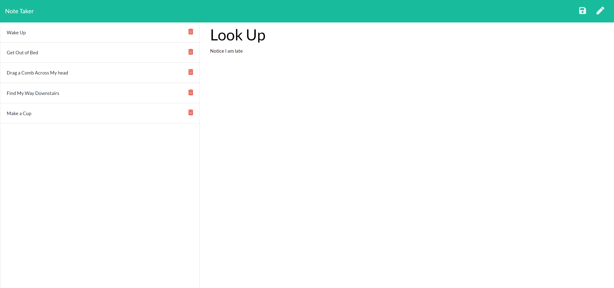

# Note Taker App 

### [Click Here for the Note Taker App](https://stormy-earth-66019.herokuapp.com/)

---

## Table of Contents
- [Description](#description)
- [Installation](#installation)
- [Usage](#usage)
- [Contributors](#contributors)
- [Testing](#testing)
- [Questions](#questions)
- [License](#license)

---

## Description
This application is a Node.js and Express based note taker deployed via a server. The application takes values for the Note Title and Note Text from the user and updates the application's database file, then posting them back on the sidebar for the user to view and manage. 

---

## Installation
As this program uses Node.js, Express, and UUID dependencies, you will want to open an integrated terminal in the project folder to installe those. First, you'll need to install package.json by typing "npm init -y" into the terminal. Then, install the node modules by typing "npm i" into the terminal. After that, we'll want to install the express dependency so type "npm i express" into the terminal. Finally, to install the UUID dependency type "npm i uuid" into the terminal.  

---

## Usage
In this day and age, we all have a tremendous amount of work and activities to keep track of. Not having a central place to keep a lof of notes or tasks you need to do is an added hassle that leads to more stress. This Note Taker app is here to help. Are you going to the grocery store later and need to make a list of items so you don't forget to pick up the duck from the butcher? Write it down in this digital notepad. Did you just have a flash of brilliance about a business idea but you're on your morning subway ride and don't have a pen or paper? Pull out your smartphone, pull up the Note Taker app, digitize it, and keep that idea with you at all times. And, when you don't need the note anymore, go ahead and delete it. 

Here is a screenshot of what the page will look like:

---

## Contributors
Starter code was provided but this project was developed by Adam Horn, with guidance from Ryan Skog.

---

## Testing
Testing files are not provided but can be done when forking and cloning the repository to your computer.  

---

## Questions
GitHub username: [mradamhorn](https://github.com/mradamhorn)

Email address: mr.amhorn@gmail.com

---

## License
